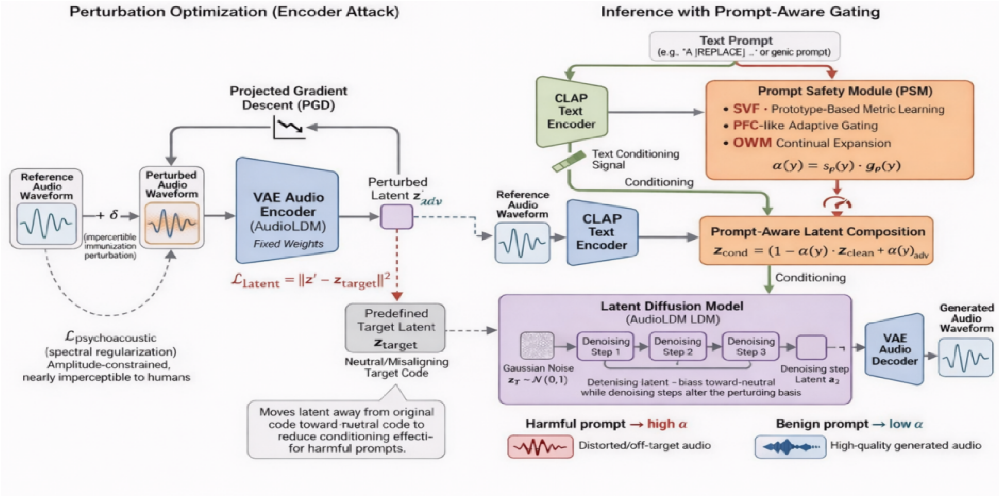

# PAI-TTA (speech_guard_core)

📌 Anonymous code release for double-blind review.

This repository provides the core implementation of PAI-TTA, a prompt-aware safety framework for text-to-audio diffusion models.
It includes: (i) prompt-aware input perturbation, (ii) a lightweight Prompt Safety Module (PSM), and (iii) evaluation scripts.


---

<p align="center">
  
</p>


---

## 📝 Abstract

Text-to-audio diffusion models may generate harmful content when given malicious prompts, which raises safety risks in real-world applications. Many existing defenses apply the same suppression strategy to all prompts, so the quality of benign generations often degrades. This paper proposes PAI-TTA, a two-part framework that protects a fixed text-to-audio generator without modifying its parameters. PAI-TTA first adds a small and hard-to-perceive perturbation to the input speech so that the perturbation has a stronger effect during the diffusion denoising process when the prompt is harmful. PAI-TTA also trains a lightweight Prompt Safety Module that maps each prompt to a continuous control signal. This signal adjusts how strongly the perturbed condition influences the diffusion process; it remains low for benign prompts and increases for harmful prompts to strengthen suppression. We evaluate PAI-TTA on AudioLDM using AudioCaps and VCTK, and the results show that prompt-aware control avoids quality degradation for benign generations while reducing harmful content generation under harmful prompts.


## 🚦 Project Status

Full release after the official publication.

| Component | Status | Timeline |
|---|---:|---:|
| Paper | ✅ Submitted | - |
| Code  | ✅ Initial Release | Jan 2026 |

---

## 📂 Repository Structure

```text
PAI-TTA/
├── src/                    # Core implementation
├── scripts/                # Entry scripts (train / infer / eval)
├── pgd/                    # Perturbation utilities
├── psm/                    # Prompt Safety Module (PSM)
├── tools/                  # Auxiliary tools
└── assets/                 # Figures used in README

## 🛠️ Environment Setup

We recommend using Conda to manage the environment.

> Note (Anonymous Release): This repo contains the core code. Large checkpoints / datasets are not included.

